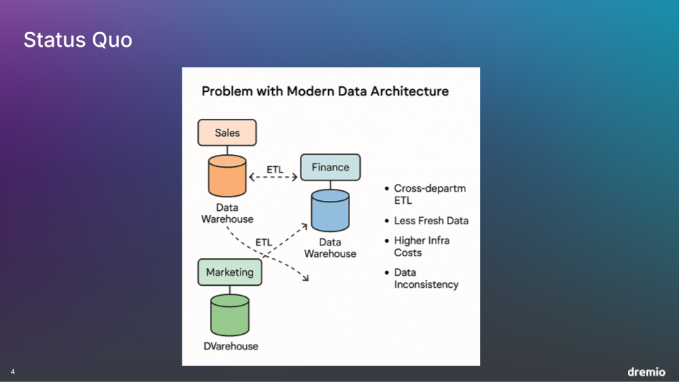

# Apache Iceberg Workshop

## Part 1 - Why Apache Iceberg and Dremio

## Part 2 - Ingesting Data into Dremio Catalog

In this part of the workshop, we will use **Apache Spark** to write an Apache Iceberg table directly into the **Dremio Catalog** of our Dremio instance. This hands-on step is more than just a technical exercise—it demonstrates the **interoperability** at the heart of modern data lakehouse architecture.

The **Dremio Catalog** is powered by **Apache Polaris**, which implements the **Apache Iceberg REST Catalog interface**. This open standard enables you to connect your preferred engine or tool—such as Spark, Trino, Fivetran, Confluent, and many others—directly to the same catalog. By adhering to the REST Catalog specification, Dremio ensures that all connected tools and engines can operate on the same Iceberg tables without custom integrations or proprietary lock-in.

**Why this matters:**

- **Unified Data Management** – All your engines and tools point to the same source of truth for metadata and table definitions.
- **Cross-Engine Interoperability** – Move seamlessly between Spark, Trino, Fivetran, Confluent, and other compatible systems without data duplication.
- **Open Standards** – Built on the Apache Iceberg REST Catalog interface, ensuring flexibility and avoiding vendor lock-in.
- **Simplified Workflows** – Ingest, query, and transform data without moving it between disparate catalogs.

By the end of this section, you’ll see firsthand how simple it is to write data with Spark into the Dremio Catalog and immediately make that data available to any other compatible tool in your analytics stack.

## Part 3 – The Benefits of Dremio Catalog

Now that you’ve seen how easy it is to use **any tool** with the Dremio Catalog, it’s worth exploring the benefits of making it your **primary Apache Iceberg catalog**.

- **No Deployment Overhead** – The Dremio Catalog is fully integrated into your Dremio deployment, eliminating the need to manage a separate catalog service.
- **Identity Provider Integration** – Leverage Dremio’s built-in integrations with a variety of IdPs for seamless authentication and governance.
- **Granular Access Controls** – Apply **Role-Based Access Control (RBAC)** and **Fine-Grained Access Control (FGAC)** directly on your Iceberg tables to enforce data security and compliance.
- **Autonomous Table Optimization** – Let Dremio automatically manage the optimization of your Apache Iceberg tables. This removes the need to develop, orchestrate, and troubleshoot custom compaction or clustering pipelines, while ensuring your tables remain performant over time.

By relying on the Dremio Catalog, you get a secure, optimized, and fully managed Iceberg catalog experience that’s ready for interoperability across your entire data ecosystem.

## Part 4 – Getting Hands-on

Now that you’ve seen me ingest data using Spark and query it with Dremio, it’s your turn to get hands-on with Dremio.

Use the link provided to access your **evaluation Dremio environment**. From there, we’ll add the **"sample"** source, which comes preloaded with sample datasets for us to query and explore.

You’ll see how straightforward it is to:

- **Add data sources** and start querying them in Dremio.
- **Create views** from sample data to experience how Dremio’s **AI-enabled semantic layer** works with your Iceberg data.
- **Explore engine management and jobs** to learn how to find detailed information about your queries and scale your lakehouse environment.

By the end of this section, you’ll have hands-on experience navigating Dremio, connecting to data, creating semantic views, and understanding how to monitor and manage your lakehouse workloads.

## Part 5 – Autonomous Reflections and Performance Management

In this section, I’ll demonstrate the power of **Dremio’s reflections** feature. Reflections are already a game-changer for accelerating queries, but when running an **Apache Iceberg lakehouse** in Dremio, they become even more impactful.

Dremio can **autonomously manage your accelerations**, allowing your data performance to improve without manual intervention. This means:

- **Automatic Table Optimization** – All tables in the Dremio Catalog are continually optimized for performance without the need for custom maintenance jobs.
- **Autonomous Acceleration Management** – Acceleration for all your Iceberg tables is handled automatically, ensuring queries are always as fast as possible.
- **End-to-End Caching Layers** – Multiple layers of caching provide additional speed, delivering **industry-leading performance** for both AI and BI workloads.

When you build your Iceberg lakehouse with Dremio, you’re not just creating a modern data platform—you’re enabling a system that keeps itself optimized, accelerated, and ready to handle demanding analytical workloads without constant manual tuning.

## Summary – Why Dremio is the Ideal Platform for Your Apache Iceberg Lakehouse

Throughout this workshop, we’ve explored how Dremio not only supports Apache Iceberg but takes it to the next level, delivering a lakehouse platform that is open, interoperable, and self-optimizing.

**Key advantages of using Dremio for your Iceberg lakehouse:**

- **True Interoperability** – Powered by Apache Polaris and the Apache Iceberg REST Catalog interface, the Dremio Catalog connects seamlessly with a wide range of tools and engines—Spark, Trino, Fivetran, Confluent, and more—ensuring all teams can work with the same data without duplication or proprietary lock-in.

- **Fully Managed Catalog Experience** – The Dremio Catalog is built into your Dremio deployment, eliminating the need to provision, deploy, or manage a separate catalog service. It’s ready from day one.

- **Enterprise-Grade Governance** – Built-in RBAC and FGAC capabilities integrate with your preferred identity provider, giving you fine-grained control over who can see and query data.

- **Autonomous Optimization and Acceleration** – Dremio continuously optimizes Iceberg tables and manages query accelerations with reflections—no manual compaction, clustering, or tuning required. Your performance improves automatically.

- **Industry-Leading Query Performance** – End-to-end caching layers and autonomous acceleration ensure your AI and BI workloads run with unmatched speed.

- **Unified Semantic Layer** – Create semantic views on top of Iceberg data and expose consistent business definitions across your organization, powered by Dremio’s AI-enabled capabilities.

By combining Apache Iceberg’s open table format with Dremio’s intelligent lakehouse platform, you get the scalability, flexibility, and openness of Iceberg with the ease-of-use, governance, and performance automation that only Dremio provides. This is a lakehouse architecture built for modern enterprises—ready to deliver fast, secure, and consistent insights across your entire data ecosystem.
